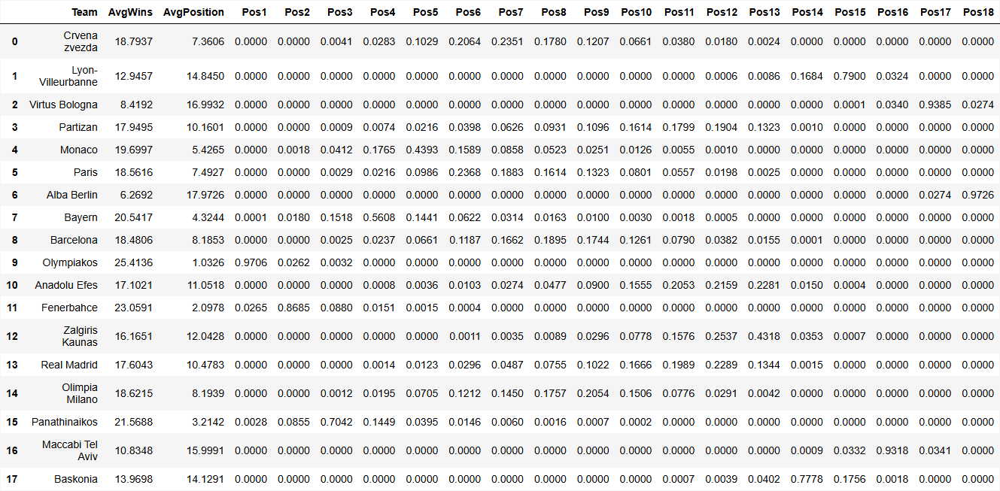
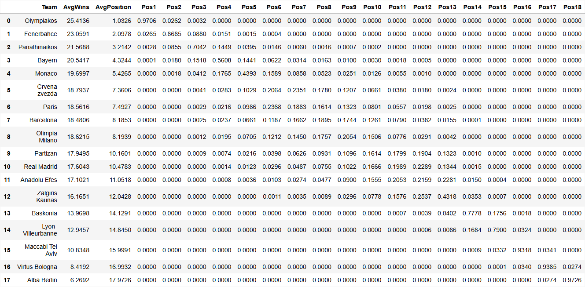
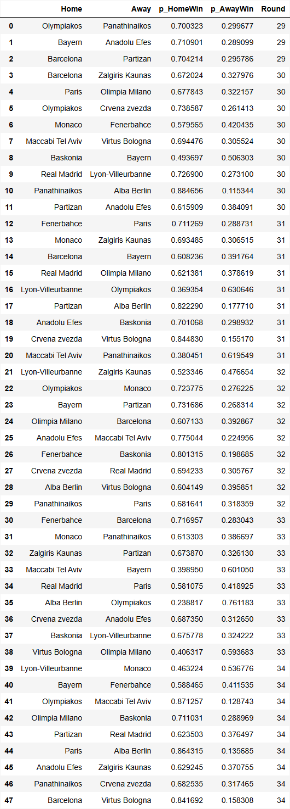
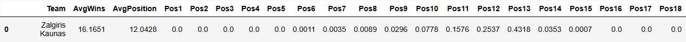

# Euroleague Simulator

## Overview

This simulation processes historical (only this season, though) results from `results.csv` to update team strengths using dynamic Elo ratings. It then reads upcoming fixtures from `remaining_games.csv` and performs Monte Carlo simulations to forecast expected wins, ranking positions, and brackets for each team.

## Viewing Results and Outputs

All simulation outputs are saved in the `output` folder. You will find:

- CSV & Image files:
  - final_table_prediction
    
  - final_bracket_prediction
    
  - every_game_prediction
    
  - selected_team_detail
    
- Image files:
  - average_wins.png
    
  - selected_team_finishing_probabilities.png
    

(Images and SVGs are located in the output folder)

## How to Run

1. Ensure Python 3 is installed.
2. Install dependencies:
   ```
   pip install pandas numpy matplotlib dataframe_image
   ```
3. Run the simulation:
   ```
   python script.py
   ```

Enjoy!
