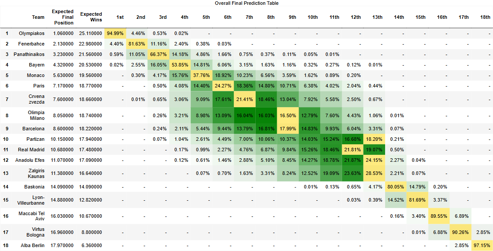
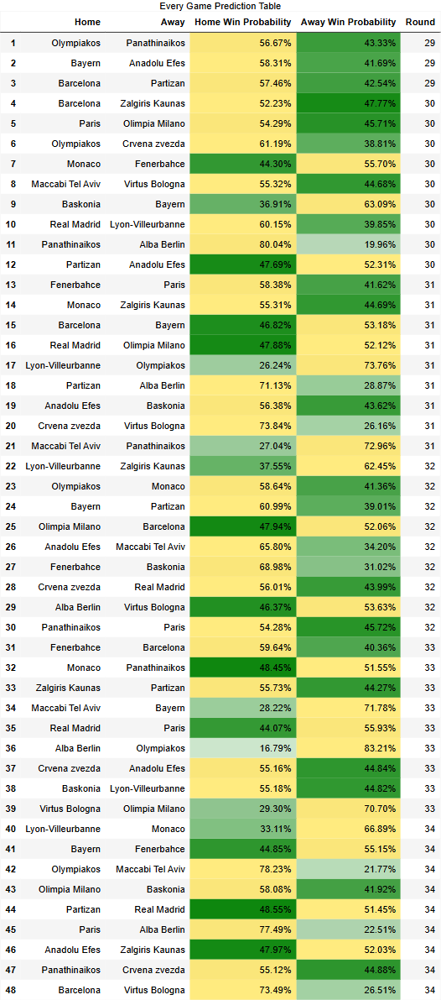
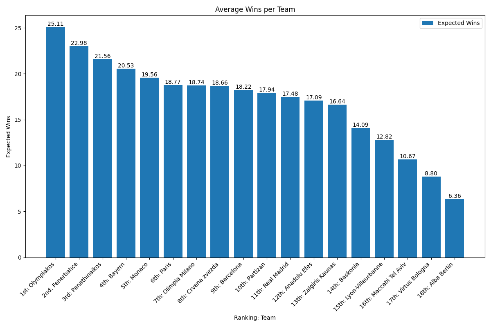
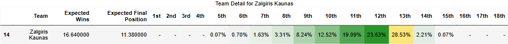
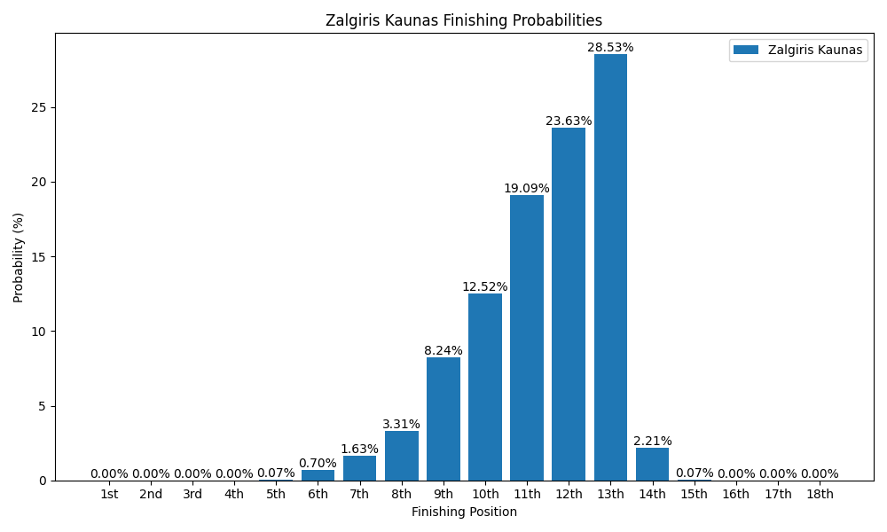

# Zalgiris Euroleague Simulation

## Overview

This project simulates the Euroleague season by analyzing historical game results and forecasting remaining matches. The simulation uses Elo ratings to estimate team performance and simulates games multiple times to determine expected wins and final positions.

### Home Advantage Calculation

The home advantage is dynamically computed as the average margin by which home teams outscore away teams in past games. This average point margin is then added to a team's Elo rating when playing at home, increasing their win probability.

## Output Files

The simulation exports several CSV and image files inside the output subfolder:

- CSV & Image files:

  - `final_prediction_table` – Overall prediction of final standings after regular season.
    
  - `every_game_prediction` – Predictions for each upcoming game.
    

- Image files:
  - `average_wins.png` – Bar chart showing expected wins per team.
    

## Individual Team Results (Example: Zalgiris Kaunas)

For each team, a folder is created under `output/default/teams/<TeamName>`. For example, the folder for `Zalgiris_Kaunas` will include:

- `team_detail.csv` – Detailed CSV output for Zalgiris Kaunas.
- `team_detail_table.png` – An image of the detailed table.
  
- `finishing_probabilities.png` – A graph of regular season finishing probabilities.
  

## How It Works

1. Historical game data is loaded and processed to calculate initial Elo ratings and determine the dynamic home advantage.
2. The remaining games are simulated thousands of times (based on a predefined number of simulations) to predict final standings.
3. Results are exported as CSV files and visualized in tables and graphs.
4. Each team’s performance details are generated into individual reports and images.

## Dependencies

- Python 3.x
- pandas
- numpy
- matplotlib
- dataframe_image
- Standard libraries: os, json, logging, uuid, hashlib, datetime, zipfile

## Usage

Run the simulation with:

```bash
python script.py
```

## How to Run

1. Make sure Python 3 is installed.
2. Install the required packages:
   ```
   pip install pandas numpy matplotlib wkhtmltopdf imgkit
   ```
3. Run the simulation:
   ```
   python script.py
   ```

Enjoy the simulation and track your team’s progress over time!
