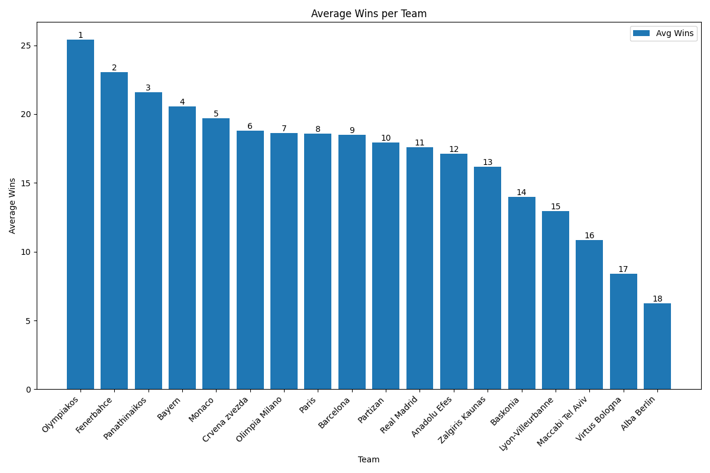
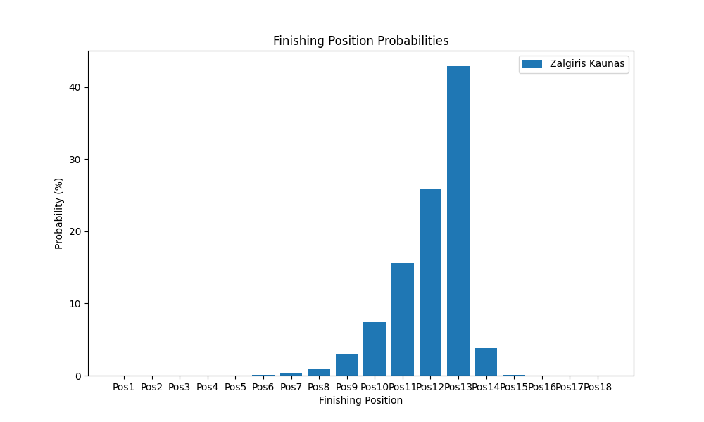

# Zalgiris Euroleague Simulation

## Overview

This simulation processes historical (only this season tho) results from `results.csv` to update team strengths using dynamic Elo ratings. It then reads upcoming fixtures from `remaining_games.csv` and performs Monte Carlo simulations to forecast expected wins, ranking positions, and brackets for each team.

## Viewing Results

To view the simulation results for Zalgiris Kaunas, open the CSV file:

- Navigate to `output\selected_team_detail.csv` to see the detailed finishing positions and averages.
- You can open this file with any spreadsheet application (e.g., Microsoft Excel, LibreOffice Calc) or a text editor.

## Outputs

All output files are saved in the `output` folder, including:

- **final_table_prediction.csv**: Expected final league table.
- **final_bracket_prediction.csv**: Teams sorted by average finishing position.
- **every_game_prediction.csv**: Game-by-game win probability predictions.
- **average_wins.png**: Graph illustrating the average wins per team.
  
- **selected_team_finishing_probabilities.png**: Graph showing the finishing position probabilities for the selected team (Zalgiris Kaunas).
  

## How to Run

1. Ensure Python 3 is installed.
2. Install dependencies:
   ```
   pip install pandas numpy matplotlib
   ```
3. Run the simulation:
   ```
   python script.py
   ```

Enjoy!
